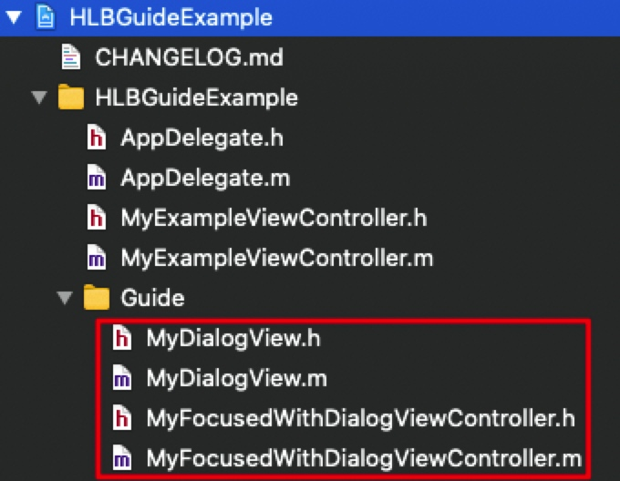

# 新功能引导组件

## 动态示例


## 静态示例


## 集成 HLBGuide

在 Podfile 中添加：  

```
pod 'HLBGuide'
```

## HLBGuide 的设计思想

> 为了能达到较高的自定义度，`HLBGuide` 的使用方式稍复杂，建议使用前先看看设计思想。（借鉴了 UITableview 的设计模式）

#### 自定义 UI 的方式

类似使用 `UITableviewController` 和 `UITableviewCell` 创建和管理自定义 cell，使用 `HLBGuide` 时，需要创建 **HLBFocusedWithDialogViewController** 和 **HLBDialogView** 的子类，来创建自定义的会话框 UI 并管理相关点击事件。不同的是，一个 `UITableviewController` 管理多个 `UITableviewCell` 子类的实例，而 `HLBFocusedWithDialogViewController` 只管理一个 `HLBDialogView` 子类的实例。  

#### 通过代理传入自定义的 HLBDialogView 子类

类似 `UITableViewDataSource` 为 `UITableviewController` 提供当前要显示的自定义 cell，使用 `HLBGuide` 时，通过遵守 **HLBFocusedWithDialogViewControllerDelegate** 协议来告知 `HLBFocusedWithDialogViewController` 使用哪个自定义的 `HLBDialogView` 子类。

#### 使用 `HLBFocusedWithDialogManager` 管理多个引导页

`HLBFocusedWithDialogManager` 内部管理着一个 window，这个 window 是展示自定义引导页的容器。  

`HLBFocusedWithDialogManager` 内部用一个数组来管理多个*引导页*（即 `HLBFocusedWithDialogViewController` 子类的实例）。使用 `-addFocusedWithDialogVC:` 方法来添加引导页，完成添加后，调用 `-show:` 来开始展示引导页。  

展示下一个引导页也是调用 `-show:` 方法，至于如何触发“展示下一个引导”需自行决定，并在 `HLBFocusedWithDialogViewController` 子类的相应的点击事件中调用 `-show:` 方法即可。

## HLBGuide 的使用方法

在 `HLBDialogView` 中添加自定义 UI ， 在 `HLBFocusedWithDialogViewController` 添加点击事件。如示例中的 `MyFocusedWithDialogViewController` 和 `MyDialogView`。  

需要注意的是， `HLBDialogView` 子类的控件需添加到的 `contentView` 中。



**然后就可以按下述步骤添加和展示引导页了：**

#### 创建引导页

初始化自定义的引导页，并遵守和实现 `HLBFocusedWithDialogViewControllerDelegate` 代理，以将自定义会话框的 `Class` 传入。

#### 将创建好的引导页添加到 `HLBFocusedWithDialogManager` 中

```
[[HLBFocusedWithDialogManager sharedInstance] addFocusedWithDialogVC:focusedWithDialogVC];
```

#### 最后开始展示引导页

```
[[HLBFocusedWithDialogManager sharedInstance] show];
```

## HLBFocusedWithDialogManager 的其他属性

#### 使用 windowLevel 设置蒙层 window 的层级

```objc
/// 指定蒙层 window 的级别
@property(nonatomic) UIWindowLevel windowLevel;
```

#### 使用 showGuideCompleteBlock 添加引导结束的回调

``` objc
/// 引导结束后的回调
@property(nonatomic, copy) HLBShowGuideCompleteBlock showGuideCompleteBlock;
```

#### 说明

详细的使用示例可参考 `HLBGuideExample` 示例工程中的 `MyExampleViewController.m`。

## UI 层级讲解：示例 app 中 UI 的层级结构

#### 总览


在新建的 `window` 上，有两个子 view，一个是带透明镂空的 `HLBFocusedView`；另一个是带三角形指示器的 `MyDialogView`，它继承自 `HLBDialogView`。  

此 `window` 的 `rootViewController` 为当前引导页对应的控制器 `MyFocusedWithDialogViewController`，它继承自组件中的 `HLBFocusedWithDialogViewController`，管理着上述的 `HLBFocusedView` 和 `MyDialogView`。   

#### HLBFocusedView

带透明镂空的蒙层，是使用 `UIBezierPath` 的 `bezierPathByReversingPath` 对矩形做的反向路径绘制。  

它可直接使用，无需自定义。  


#### MyDialogView

带三角形指示器的会话框（由于三角形是在 layer 上绘制的，所以在 reveal 中没有显示）。  

`MyDialogView` 继承自 `HLBDialogView`，子类可在 `contentView` 上添加自定义控件（如本示例中的 UILabel 和 UIButton）。


